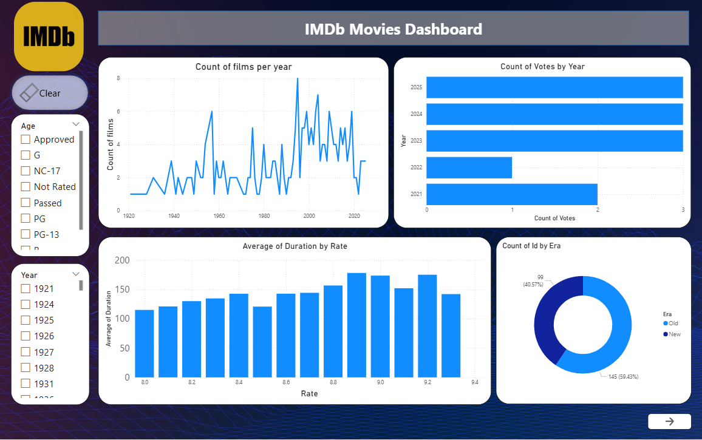
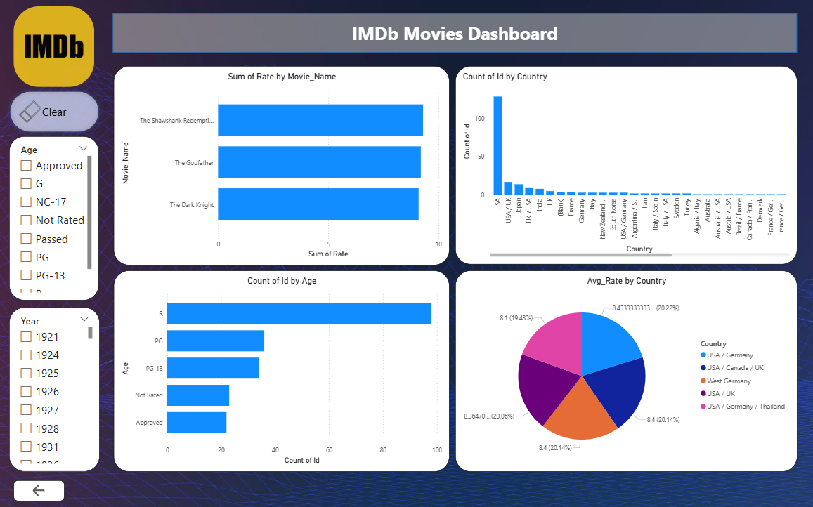

# End-to-End IMDb BI Analytics Project (Power BI)

## Project Overview

This project demonstrates an **end-to-end Business Intelligence workflow** using IMDb movie website data.
It covers **data acquisition, cleaning, transformation, relational data modeling, DAX calculations, and interactive dashboard design** to deliver actionable insights.

The dashboard enables exploration of movie trends, ratings, votes, durations, and distribution across **eras, countries, and age groups**, supporting data-driven decision making.

---

## Key Features

### Data Acquisition & Preparation

- Collected IMDb movie data via **web scraping** from official sources.
- Cleaned and transformed raw data using **Power Query (M Language)**.
- Added calculated columns and performed data transformations for enhanced analytics.

### Data Modeling & DAX

- Built a **relational data model** connecting multiple tables for analytical queries.
- Developed **DAX measures** for key performance indicators (KPIs):
  - Count of films per year
  - Count of votes per year
  - Average duration by rating
  - Count of movies by era (new vs old)
  - Sum of ratings by movie name
  - Count of movies by country
  - Count of movies by age group
  - Average rating by country

### Interactive Dashboard

- Filters for **year** and **age group** to dynamically explore data.
- Navigation buttons to switch between dashboard pages.
- Clear filters button for quick reset of selections.
- Fully interactive, visually appealing, and optimized for user experience.

---

## Technology Stack

- **Power BI Desktop** – Dashboard creation & visualization
- **DAX** – Measures, calculated columns, KPIs
- **Power Query (M Language)** – Data cleaning and transformation
- **Web Scraping** – Data acquisition from IMDb

---

## Project Structure

```
IMDb-BI-Project/
│
├── visuals/      # Screenshots or GIFs of dashboard
├── data/        # Raw data
├── dashboard/   # Power BI .pbix files
```

---

## Usage Instructions

1. Open the `.pbix` file in **Power BI Desktop**.
2. Use filters to explore movies by **year** or **age group**.
3. Navigate between dashboard pages using the buttons.
4. Reset filters using the **Clear Filters** button.
5. Analyze insights for trends in movie ratings, votes, durations, and distribution.

---
### Dashboard Preview



## Author

**Habiba Ibrahim Elmsery**

- [Linkedin](https://www.linkedin.com/in/habiba-ebrahim/)
- [Email](he046549@gmail.com)

---
